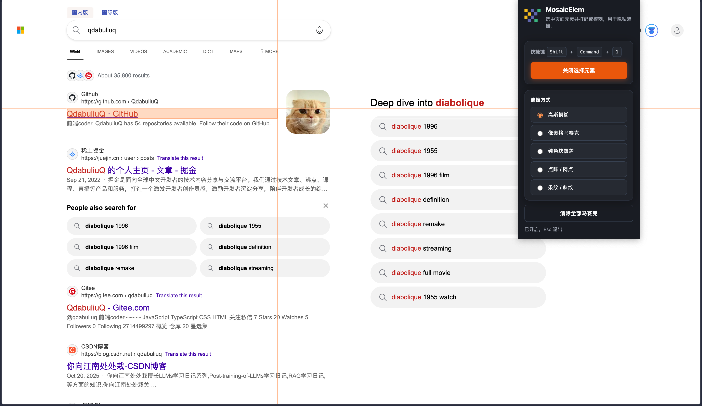
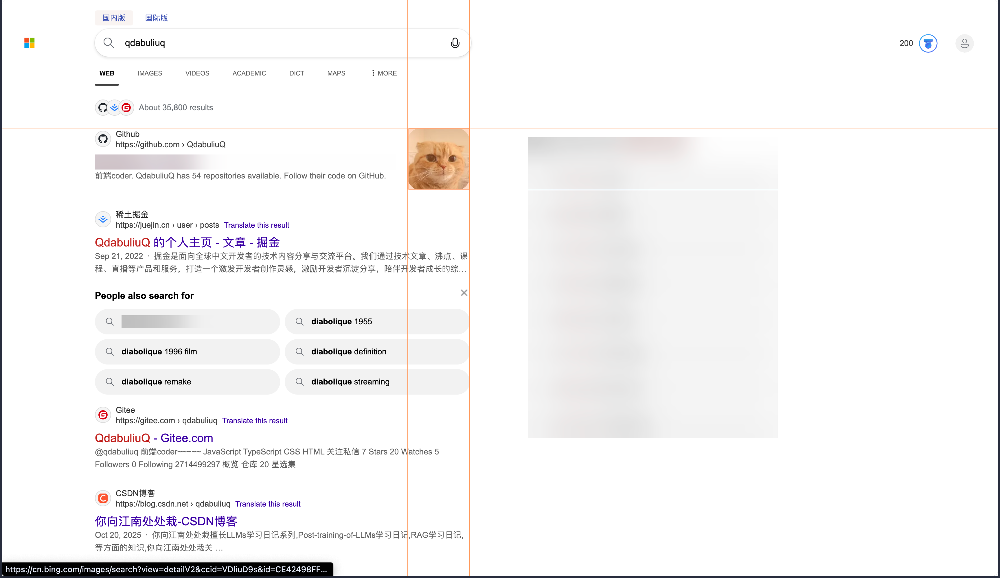

# MosaicElem

<p align="center">
  <b>English</b>
  &nbsp;·&nbsp;
  <b><a href="README.zh-CN.md">中文</a></b>
</p>

Chromium extension (**Manifest V3**) to **pick elements** on any page and apply **blur or mosaic-style obfuscation** before screenshots or screen sharing—handy for quick privacy redaction.

## Website (live demo)

**Production:** [GitHub Pages](https://qdabiliuq.github.io/mosaic-elem/) (deployed automatically on push to `main` via [`.github/workflows/deploy-website.yml`](.github/workflows/deploy-website.yml)).

**Local preview:**

```bash
bash scripts/build-website.sh
npx --yes serve .website-dist
```

The demo uses the same masking engine as the extension (`shared/mosaic-engine.js`). From the extension popup, **Website · Live demo** opens the bundled copy inside the extension.

### Enable GitHub Pages (one-time)

1. Repo **Settings → Pages**
2. **Build and deployment → Source:** GitHub Actions
3. Push to `main`; the **Deploy website** workflow publishes the site

## Preview

<p align="center">
  
  &nbsp;&nbsp;
  
</p>

## Features

- **Pick mode** — hover highlight, click to toggle obfuscation on the element under the cursor; **Esc** exits pick mode.
- **Single toggle** — one control in the popup (plus optional keyboard shortcut) to start/stop picking.
- **Multiple obfuscation styles** — Gaussian blur, pixel/grid mosaic, solid overlay, dot/halftone, diagonal stripes.
- **Per-tab styling** — selected mode is persisted and broadcast to other tabs.
- **i18n** — English (`en`) and Simplified Chinese (`zh_CN`).
- **Robust masking** — a dedicated overlay node avoids common `::after` conflicts (e.g. Tailwind `after:`); `textarea` / `select` / text-like `input` are wrapped so masking works reliably.

## Requirements

- **Google Chrome**, **Microsoft Edge**, or another **Chromium MV3** browser.

## Install from source

1. Clone the repo (or download ZIP and extract).
2. Open extensions:
   - Chrome: `chrome://extensions`
   - Edge: `edge://extensions`
3. Turn on **Developer mode**.
4. **Load unpacked** → choose the folder that contains `manifest.json`.

## Usage

1. Optionally pin **MosaicElem**.
2. Open the popup, pick an **obfuscation mode**, then **Start / Stop picking elements** (or use the shortcut).
3. Hover the page and **click** a target to apply masking; click the same region again to remove it.
4. **Esc** exits pick mode.
5. **Clear all obfuscation** removes every masked node on the current page.

Reload the tab once if it was already open when you installed or updated the extension.

## Default keyboard shortcut

| Platform | Shortcut |
| -------- | -------- |
| Windows / Linux / ChromeOS | **Ctrl + Shift + 1** |
| macOS | **Command + Shift + 1** |

Change it under extension keyboard shortcuts:

- Chrome: `chrome://extensions/shortcuts`
- Edge: `edge://extensions/shortcuts`

Values in `manifest.json` only **suggest** a binding; they do not replace a shortcut you already customized.

## Permissions

| Permission | Purpose |
| ---------- | ------- |
| `storage` | Stores the chosen obfuscation mode. |
| `activeTab` | Lets the popup / command act on the active tab when you invoke the extension. |
| `<all_urls>` (host) | Injects the content script on pages you visit; **no** remote analytics server is used by this project. |

## Repository layout

```
├── manifest.json
├── background.js
├── content.js
├── page-pick.js
├── popup.html / popup.css / popup.js
├── website/              # official site + live demo
├── shared/mosaic-engine.js
├── .github/workflows/    # GitHub Pages deploy
├── icons/
├── screenshots/          # optional images for docs / README
└── _locales/
```

## Localization

Strings live in `_locales/<locale>/messages.json`. Default locale: `en` (see `manifest.json`).

## Contributing

Issues and PRs are welcome—keep changes scoped and consistent with existing style.

## License

No `LICENSE` file is bundled yet. Add one (e.g. MIT) when you publish publicly.
